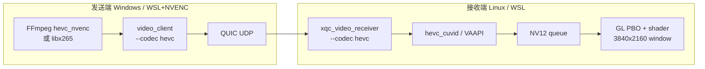

# 跨端 HEVC (H.265) 低延迟收发 + 收端显示

与 [`VIDEO_LOW_LATENCY_WINDOWS_DESIGN.md`](VIDEO_LOW_LATENCY_WINDOWS_DESIGN.md) 对齐的**可执行路径**：

| 端 | 角色 | 技术 |
|----|------|------|
| **发送** | Windows / Linux + NVIDIA | `hevc_nvenc` → Annex-B `.h265` → `video_client` QUIC |
| **接收** | Linux / WSL2 + NVIDIA | QUIC → `hevc_cuvid` (NVDEC) → NV12 → **OpenGL PBO** 显示 |
| **双栈** | 任选一端 | `--codec h264` 保留 H.264（`h264_cuvid` / `libx264`） |

Wire 格式不变：`xqc_video_frame_header_t` (16B) + NAL RBSP；codec 由 **`--codec`** 与文件后缀约定，收发双方须一致。

### 测试阶段（建议顺序）

| 阶段 | 文档 / 脚本 | 说明 |
|------|-------------|------|
| 1. 本地 CUDA | [`WSL_HW_DECODE_TEST_MATRIX.md`](WSL_HW_DECODE_TEST_MATRIX.md) §1、`wsl_video_e2e_cuda.sh` | NVIDIA WSL 收端 — **你已完成** ✅ |
| 2. 本地 VAAPI | 同上 §2、`wsl_video_e2e_vaapi.sh` | Intel/AMD 另环境；NVIDIA WSL 可跳过 |
| 3. **跨端** | **本文 §2–§5** | Windows `hevc_nvenc` 发 → Linux/WSL `hevc_cuvid` 收 + 显示 |

---

## 1. 架构（跨端）



**收端显示路径（与 GPU 绑定，勿混用）**

| GPU | 硬解 | 显示 |
|-----|------|------|
| **Intel / AMD** | VAAPI | **VAAPI + EGL + DMA-BUF**（最佳） |
| **NVIDIA** | CUDA / NVDEC | **CUDA/NVDEC + GLX + PBO** |

跨端 NVIDIA 收端：`hevc_cuvid` → `hwdownload` → NV12 → **GLX + PBO**（不用 EGL）。

---

## 2. 发送端（Windows 推荐）

### 2.1 生成 4K HEVC Annex-B（NVENC）

在 **带 NVIDIA 驱动 + FFmpeg NVENC** 的机器上（PowerShell 或 WSL 均可）：

```bash
cd /mnt/e/ros2/xquic   # 或 Windows 路径

# 4K 10s 测试码流（可调 WIDTH/HEIGHT/FPS/DURATION）
WIDTH=3840 HEIGHT=2160 FPS=30 DURATION=10 GOP=30 \
  bash scripts/gen_hevc_annexb.sh cam4k.h265
```

参数模板见 [`docs/config/hevc_nvenc_low_latency.json`](config/hevc_nvenc_low_latency.json)；部署前执行 `ffmpeg -h encoder=hevc_nvenc` 核对键名。

### 2.2 QUIC 发送

```bash
# Linux / WSL 客户端（与仓库构建一致）
./build_wsl/xquic_tests/video_client \
  -a <接收端IP> -p 8443 \
  --cam0 cam4k.h265 \
  --codec hevc \
  --fps 30
```

Windows 上若有 `video_client.exe`，命令相同；证书/端口与接收端一致。

---

## 3. 接收端（Linux / WSL2 + 显示）

### 3.1 环境与构建

见 [`WSL_FFMPEG_HW_BUILD_AND_TEST.md`](WSL_FFMPEG_HW_BUILD_AND_TEST.md)：

- 自编译 FFmpeg：`hevc_cuvid`、`libx265`（测试码流）
- cmake：`-DXQC_ENABLE_LOWLATENCY_FFMPEG=ON -DXQC_ENABLE_HW_DECODE=ON`
- **WSLg 显示**：`export DISPLAY=:0`

### 3.2 启动（硬解 + 显示）

```bash
export PKG_CONFIG_PATH="$HOME/ffmpeg-hw/lib/pkgconfig:$PKG_CONFIG_PATH"
export LD_LIBRARY_PATH="$HOME/ffmpeg-hw/lib:$LD_LIBRARY_PATH"
export DISPLAY=:0

# NVIDIA WSL：建议 cuda，避免 VAAPI -22 后误用 EGL
export XQC_HW_DECODE=cuda

./build_wsl/xquic_tests/xqc_video_receiver \
  -p 8443 \
  -c tests/server.crt \
  -k tests/server.key \
  --video-dir ./build_wsl/video_out_cross \
  --decode \
  --display \
  --codec hevc \
  --hw-decode=cuda \
  --no-eos-file-decode
```

期望日志：

```text
[decode] hw ready backend=cuda+pbo default_codec=hevc
[gl] GLX context (PBO upload, hevc_cuvid path)
[gl] display thread running
[decode] camera codec=hevc backend=cuda+pbo
```

纯流式 E2E 延迟直方图需 `--display` + `--no-eos-file-decode`（见 `xqc_e2e_latency.hh`）。

### 3.3 本机 E2E 自检（非跨端）

与跨端无关，仅验证收端栈：

```bash
export DISPLAY=:0
export EOS_FLAGS="--no-eos-file-decode"
bash scripts/wsl_video_e2e_cuda.sh      # CUDA
# bash scripts/wsl_video_e2e_vaapi.sh  # VAAPI（Intel/AMD）
```

---

## 4. 跨端操作步骤（Windows 发 → WSL/Linux 收）

### 4.1 网络与防火墙

- 接收端监听 `UDP 8443`（`0.0.0.0`）；Windows 防火墙 / 路由器放行。
- 发送端 `-a` 填 **接收机可达 IP**（WSL 常用 Windows 局域网 IP + 端口转发，或 `hostname -I` 中非 127 地址）。
- 先在同一台机用 `127.0.0.1` 打通，再换真跨端 IP。

### 4.2 接收端（WSL/Linux，CUDA + 显示）

**终端 A** — 先启动 receiver：

```bash
cd /mnt/e/ros2/xquic
export PKG_CONFIG_PATH="$HOME/ffmpeg-hw/lib/pkgconfig:$PKG_CONFIG_PATH"
export LD_LIBRARY_PATH="$HOME/ffmpeg-hw/lib:$LD_LIBRARY_PATH"
export DISPLAY=:0
export XQC_HW_DECODE=cuda

./build_wsl/xquic_tests/xqc_video_receiver \
  -p 8443 -c tests/server.crt -k tests/server.key \
  --video-dir ./build_wsl/video_out_cross \
  --decode --display --codec hevc --hw-decode=cuda \
  --no-eos-file-decode
```

确认：`[gl] display thread running`、`stream_nv12 > 0`（发送后看 `[stats]`）。

### 4.3 发送端（Windows，NVENC）

**终端 B** — 在 **带 NVIDIA + NVENC 的 Windows**（或 WSL 发向对端）：

```powershell
cd E:\ros2\xquic   # 或你的路径

# 生成 4K 或先用短 clip 调试
bash scripts/gen_hevc_annexb.sh cam4k.h265
# 或复用 build_wsl\test_cam0.h265

.\build_wsl\xquic_tests\video_client.exe `
  -a <RECEIVER_IP> -p 8443 `
  --cam0 cam4k.h265 --codec hevc --fps 30
```

Linux 发端将 `video_client.exe` 换为 `./build_wsl/xquic_tests/video_client`。

### 4.4 收端为 Intel/AMD（VAAPI，可选）

跨端接收机若是 **核显 VAAPI** 而非 NVIDIA：

```bash
export XQC_HW_DECODE=vaapi
export XQC_VA_DEVICE=/dev/dri/renderD128
./build_wsl/xquic_tests/xqc_video_receiver ... --hw-decode=vaapi --display --codec hevc
```

发送端仍为 HEVC Annex-B，**与 NVENC/CUDA 无关**；显示走 EGL dma-buf。详见 [`WSL_HW_DECODE_TEST_MATRIX.md`](WSL_HW_DECODE_TEST_MATRIX.md) §2。

---

## 5. 双栈（H.264）

| 发送 | 接收 |
|------|------|
| `--codec h264` + `.h264` | `--codec h264` |
| `libx264` / 软编码流 | `h264_cuvid` 或软解 |

同机可并存 `cam0.h265` + `cam1.h264`（`--cam0` / `--cam1`，`xqc_h264_decode_set_camera_codec`）。

---

## 6. 验收清单

### 跨端（必做）

- [ ] 接收端先起，日志含 `[decode] hw ready backend=cuda+pbo`
- [ ] 发送端 `Loaded ... codec=hevc`，无握手失败
- [ ] 接收端 `stream_nv12 > 0`，WSLg **有画面**
- [ ] `video_out_cross/cam_0.h265` → `ffprobe` 为 `hevc`

### CUDA 本地（回归）

- [ ] `bash scripts/wsl_video_e2e_cuda.sh` 通过

### VAAPI 本地（Intel/AMD 环境）

- [ ] `bash scripts/wsl_video_e2e_vaapi.sh` → `backend=vaapi+egl`

---

## 7. 常见问题

| 现象 | 处理 |
|------|------|
| 无 `hevc_nvenc` | Windows：安装带 NVENC 的 FFmpeg；WSL：需 GPU 透传 + 带 nvenc 的构建 |
| VAAPI -22，无画面 | `export XQC_HW_DECODE=cuda`；确保 `DISPLAY=:0` |
| `--display failed` | 安装 `libglfw3-dev`；勿在 NVIDIA WSL 上强制 EGL（已修复：仅 VAAPI 用 EGL） |
| 有解码无 stream_nv12 | 确保 receiver 在 client 之前启动；CUDA 初始化已提前到 `worker_start` |
| 码流不通 | 双方 `--codec` 一致；防火墙放行 UDP 8443 |

---

## 8. 与设计文档对应

| 设计章节 | 本仓库落点 |
|----------|------------|
| §7 `hevc_nvenc` | `scripts/gen_hevc_annexb.sh`、`docs/config/hevc_nvenc_low_latency.json` |
| §6 NVDEC + NV12 | `xqc_h264_hw_linux.cpp` (`hevc_cuvid`) |
| §5 PBO 显示 | `xqc_nv12_gl_linux.cpp`、`xqc_pbo_dynamic_manager.hh` |
| §8 边界 | `xqc_video_recv_process.hh`、`xqc_h264_ff_decode_worker.cpp` |
| 跨端 QUIC | `video_client` / `xqc_video_receiver` |

Windows 同进程 Seastar + NVDEC 仍为 [`VIDEO_LOW_LATENCY_WINDOWS_DEV_PLAN.md`](VIDEO_LOW_LATENCY_WINDOWS_DEV_PLAN.md) Phase W2–W4；**跨端验证**以本文 **WSL/Linux 收端 + Windows/Linux 发端** 为准。
