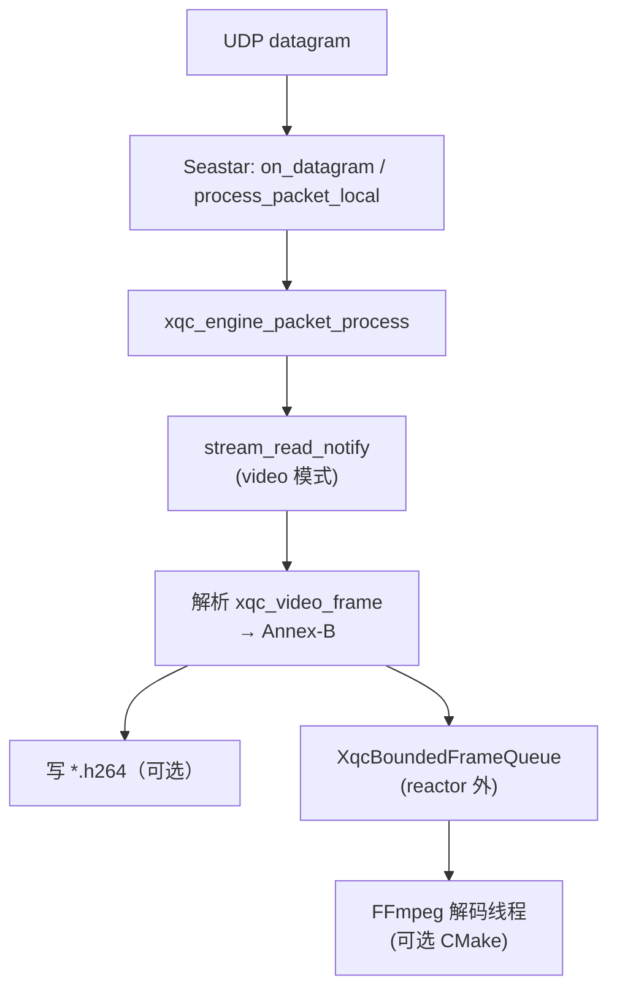

# DPDK + Seastar + XQUIC 架构梳理、开发计划与风险

**文档目的**：基于当前仓库实现，说明 **DPDK 不直接链接 XQUIC**，而是通过 **Seastar 的 Native 网络栈（可选 DPDK 后端）** 提供 UDP I/O；XQUIC 仍以 C 库形式在 **每个 Seastar shard 的 reactor 线程** 内调用。本文与 `SEASTAR_ARCHITECTURE_ANALYSIS.md`、`docs/PHASE3_SEASTAR_DPDK_SERVER_EVAL.md`、`docs/DPDK_USAGE_GUIDE.md` 互补，侧重**边界划分、构建形态与落地计划**。

**适用读者**：负责服务端性能、多核扩展与运维的同事。

---

## 1. 组件边界（事实模型）

| 组件 | 职责 | 与 XQUIC 的关系 |
|------|------|-----------------|
| **XQUIC** | QUIC/HTTP3 协议、TLS（quictls）、流与包处理 | 核心库 `libxquic`；通过 `xqc_engine_packet_process` 收包、`ss_write_socket` 等回调发包 |
| **Seastar** | 异步 reactor、UDP channel、`distributed<>` 多核 | 承载 **UDP 收发循环**、定时器、`smp::submit_to` 跨核投递 |
| **DPDK** | 用户态 PMD、大页、多队列（由 Seastar 使用） | **仅当** CMake 中 `Seastar_DPDK=ON` 时进入 Seastar Native 栈；**XQUIC 源码不 include DPDK** |

**结论**：架构是 **「Seastar（网络与调度） + XQUIC（协议栈）」**；DPDK 是 Seastar 的一种**编译/运行配置**，不是第三条独立协议栈。

---

## 2. 运行时数据路径（服务端）

### 2.1 接收路径

```
网卡 → Seastar 网络栈（POSIX 或 Native/DPDK）
     → udp_channel.receive()
     → XquicSeastarServer::on_datagram()
         → （POSIX 多 shard）shard 0 上按 DCID 路由 → smp::submit_to(target_shard, ...)
         → process_packet_local()
             → xqc_engine_packet_process(engine, udp_payload, ..., now_us, ...)
     → xquic 内部：解密、QUIC 状态机、流回调
     → on_stream_read_notify / on_h3_request_read_notify（应用逻辑）
```

### 2.2 发送路径

```
xquic 需发包时 → 静态回调 ss_write_socket()
              → XquicSeastarSendIntegration::enqueue_write()
                  → 拷贝入 temporary_buffer，入队（有界 deque）
              → schedule_send_flush()
              → flush_to(udp_channel)  // 或 eBPF 变体中的 pollable_fd + GSO
                  → udp_channel.send(peer, packet(std::move(payload)))
```

要点：

- **收**：每包进入 `xqc_engine_packet_process`；Native/DPDK 下多 shard **各自绑定端口**，由栈分发，避免 POSIX 下 shard 0 瓶颈。
- **发**：经 **有界发送队列**（默认容量见 `xquic_seastar_queue.hh`）异步 flush；队列满时返回 `EAGAIN`，依赖 xquic 重传语义（见 `flush_to_pollable_fd_with_gso` 注释）。

### 2.3 多核模型

- **`seastar::distributed<XquicSeastarServer>`**：每 shard 一个 `XquicSeastarServer` 实例、**独立** `xqc_engine_t*`。
- **CID 生成**：`ss_cid_generate` 在 CID 中嵌入 `shard_id`，便于 O(1) 路由意图（与 `xquic_server_seastar.hh` 注释一致）。
- **POSIX + 多 shard**：shard 0 收所有包并 `submit_to` 转发，存在单点与额外延迟。
- **Native/DPDK**：`has_per_core_namespace()` 为真时走每核命名空间路径，每 shard 独立收包（见 `xquic_server_seastar.cpp` 中 `_native_stack` 检测逻辑）。

### 2.4 eBPF 变体（独立二进制）

- **`xquic_server_seastar_ebpf`**：`tests/xquic_server_seastar_ebpf.cpp`，在 **Linux POSIX 栈** 上配合 **SO_REUSEPORT + eBPF** 做内核侧分发，减轻 shard 0 瓶颈。
- 与 DPDK **二选一或分场景**：eBPF 依赖内核与策略；DPDK 依赖绑卡、大页、权限。二者在仓库中均为**评估/增强路径**，不是默认单一路线。

### 2.5 视频媒体字节流（在 Seastar + XQUIC 栈中的位置）

视频业务仍走 **§2.1 同一收包路径**：`udp_channel` → `xqc_engine_packet_process` → **transport ALPN `transport`** 上的 **`on_stream_read_notify`**。与「纯 echo」不同之处在于：回调内对 **流字节** 做 **xquic 视频 wire（16B 头 + NAL）** 重组，再 **写盘** 和/或 **推入有界队列** 供 **独立解码线程** 消费（详见 **`VIDEO_LOW_LATENCY_WINDOWS_DESIGN.md` §0**）。



**结论**：**DPDK / eBPF / POSIX** 只改变 **UDP 如何进 `xqc_engine_packet_process`**；**视频语义**（wire、队列、解码）位于 **xQUIC 流回调之上**，与网络后端正交。

### 2.6 GPU / CPU 分工（WSL `xqc_video_receiver` 现状，4K 目标）

| 阶段 | 线程 | 硬件 | 实现位置 |
|------|------|------|----------|
| QUIC + wire 解析 | reactor（libevent） | CPU | `xqc_video_recv_process.hh` |
| H.264 解码 | 解码线程 | **CPU**（FFmpeg software） | `xqc_h264_ff_decode_worker.cpp` |
| NV12 打包 / 色彩转换 | 解码线程 | **CPU**（`memcpy` / libswscale） | 同上 |
| 有界 NV12 队列 | 解码 → display bridge | CPU RAM | `xqc_bounded_frame_queue.hh`（深度 4，4K ≈ 48 MiB 峰值） |
| PBO 上传 + 纹理 | display（GLFW） | **GPU**（OpenGL PBO `glTexSubImage2D`） | `xqc_nv12_gl_linux.cpp` |
| YUV→RGB + 合成 | display | **GPU**（GLSL 3.3） | 同上 |
| 呈现 | display | **GPU**（swapchain） | `glfwSwapBuffers`；E2E 采样点 |
| E2E 直方图 | display 记录 / stats 打印 | CPU | `xqc_e2e_latency.hh`（`recv→display`、`wire_pts→display`） |

**说明**：Linux/WSL 路径**未**使用 NVDEC/VAAPI/CUDA；Windows 可选 D3D11VA 硬解，但仍需在展示前落到 NV12。纯流内延迟测量建议：`--decode --display --no-eos-file-decode`，窗口按 **3840×2160** 预配（`xqc_video_target.hh`）。

### 2.7 硬件解码 + EGL 零拷贝（Linux，4K 压测）

**操作手册（WSL 编 FFmpeg + cmake + 测试全流程）**：见 **[`WSL_FFMPEG_HW_BUILD_AND_TEST.md`](WSL_FFMPEG_HW_BUILD_AND_TEST.md)**。

构建要点：自编译 FFmpeg → 设置 `PKG_CONFIG_PATH` / `LD_LIBRARY_PATH` → `XQC_ENABLE_HW_DECODE=ON`。
脚本：[`scripts/build_ffmpeg_hw_linux.sh`](../scripts/build_ffmpeg_hw_linux.sh)；E2E：[`scripts/wsl_video_e2e.sh`](../scripts/wsl_video_e2e.sh)。

| 后端 | 解码 | 显示 | 启用方式 |
|------|------|------|----------|
| **VAAPI** | GPU (`hevc_vaapi` / `h264_vaapi`) | **dma-buf → EGLImage**（零拷贝） | `--codec hevc` + `--hw-decode=vaapi` |
| **CUDA/NVDEC** | GPU (`hevc_cuvid` / `h264_cuvid`) | CPU NV12 → PBO | `--codec hevc` + `--hw-decode=cuda` |
| **software** | CPU H.265/H.264 双栈 | PBO | `--hw-decode=off`；`--codec h264` 保留 H.264 |

**远端 4K 压测（另一台电脑发流）**：

```bash
# 接收端（本机，WSLg 或 Linux 桌面）
export XQC_VA_DEVICE=/dev/dri/renderD128
./build_wsl/xquic_tests/xqc_video_receiver -p 8443 -c tests/server.crt -k tests/server.key \
  --decode --display --codec hevc --no-eos-file-decode --hw-decode=auto

# 发送端（另一台机器，替换 IP/码流）
ffmpeg -f lavfi -i testsrc=size=3840x2160:rate=30 -t 60 -c:v libx264 -preset ultrafast \
  -profile:v high -pix_fmt yuv420p -g 30 -f h264 - | \
  ./video_client -a <RECEIVER_IP> -p 8443 --cam0 /dev/stdin --fps 30
# 或先落盘: ffmpeg ... -f h264 cam4k.h264 && ./video_client ... --cam0 cam4k.h264 --fps 30
```

E2E 直方图见 `xqc_e2e_latency.hh`（`recv→display` / 锚定 `wire_pts→display`）。

---

## 3. 构建与产物

### 3.1 CMake 开关

- 根目录 `CMakeLists.txt`：`option(XQC_ENABLE_SEASTAR ...)`；开启后加入 `third_party/seastar` 子工程，并设置 `XQC_ENABLE_SEASTAR_EXAMPLE` 以编译 `tests/` 下 Seastar 示例。
- `tests/CMakeLists.txt`：在 `XQC_ENABLE_SEASTAR_EXAMPLE` 下构建 `xquic_server_seastar`、`xquic_server_seastar_ebpf`，链接 `Seastar::seastar`（或 pkg-config 回退）。

### 3.2 脚本与 DPDK

- **`build_seastar.sh`**：`./build_seastar.sh` 默认 **非 DPDK**；`./build_seastar.sh dpdk` 追加 `-DSeastar_DPDK=ON -DSeastar_DPDK_MACHINE=...`，构建目录默认为 `build_seastar/`（若需与 POSIX 构建并存，运维上可使用独立 `-B` 构建目录，避免配置混写）。
- **SSL**：Seastar 与 XQUIC 共用 **quictls** 安装路径（脚本内 `OPENSSL_*` 与 `SSL_PATH` 对齐）。

### 3.3 相关可执行文件

| 目标 | 说明 |
|------|------|
| `xquic_server_seastar` | Seastar + XQUIC 服务端主示例 |
| `xquic_server_seastar_ebpf` | reuseport + eBPF 分发版本 |
| `test_client` / `video_client` / `video_bench` | libevent 客户端，用于压测与视频流场景（与 Seastar 服务端协议对齐） |

---

## 4. 与「4K 低延迟解码显示」的关系（仓库现状）

当前 Seastar 服务端 **`xquic_server_seastar` 的 video 模式**：在 **`on_stream_read_notify`** 中累积数据、按 **`xqc_video_frame`** 解析，**默认写磁盘**（如 `cam_*.h264`）。在开启 **`XQC_ENABLE_LOWLATENCY_FFMPEG`** 且运行时带上 **`--video-decode`** 时，同一解析路径会 **额外** 将 Annex-B 切片送入 **`XqcBoundedFrameQueue` + FFmpeg 解码线程**（reactor 不做重解码）；**OpenGL PBO 实时显示**仍属 **`VIDEO_LOW_LATENCY_WINDOWS_DESIGN.md`** 中的产品主路径（§0 数据流图、§5–§6），与 Seastar 示例二进制可同进程或分进程组合。

若产品目标为 **HEVC + NVDEC + GL 全链路**，仍以 **`docs/VIDEO_LOW_LATENCY_WINDOWS_DESIGN.md`** 为规格源（**HEVC → NVDEC → NV12 → PBO → shader**），并严格避免在 **Seastar reactor 线程** 上执行长时间 `avcodec_*` / `glMapBuffer*`（与 `AGENTS.md` 中「避免阻塞回调」一致）。

推荐边界：

- **Reactor 线程**：只做收包、`xqc_engine_packet_process`、轻量入队、定时器与 flush 调度。
- **解码/渲染**：独立线程（或专用 executor）+ 有界队列 +「最新帧优先」策略；解码侧 **H.265 + NVDEC**（或过渡阶段 **H.264**），显示侧 **OpenGL PBO**；与 `SEASTAR_ARCHITECTURE_ANALYSIS.md` 中的优化方向一致。

---

## 5. 开发计划（建议分阶段）

以下顺序兼顾**可验证性**与**风险前置**。

### Phase A — 基线与可观测性（1–2 周）

1. **固定构建矩阵**：POSIX Seastar / eBPF / DPDK 三套二进制版本号、CMake 缓存、`Seastar_DPDK` 状态写入发布物或 `environment.txt`（与 `scripts/seastar_dpdk_server_eval.sh` 一致）。
2. **启动自检**：日志打印网络栈类型（`_native_stack`）、shard 数、端口绑定结果；DPDK 路径下记录 EAL 参数与 PMD。
3. **统一压测入口**：以 `scripts/seastar_dpdk_server_eval.sh`、`scripts/seastar_test.sh` 为 CI 或 nightly 入口，产出 CSV 与 p50/p95/p99（字段定义见 Phase3 文档）。

**验收**：同硬件、同参数下三套结果可对比。

### Phase B — 服务端路径优化（2–4 周，与业务并行）

1. **发送队列**：背压策略文档化（满队列 `EAGAIN` 与重传）；评估容量与 `flush` 调度频率（见既有分析中的 deque / 递归 flush 讨论）。
2. **接收侧**：POSIX 多核场景优先验证 **eBPF 分发**是否满足目标；DPDK 作为**专网卡/机房**选项。
3. **内存**：video/echo 路径上的 `realloc`、栈上大缓冲等按 `SEASTAR_ARCHITECTURE_ANALYSIS.md` 中的「Quick Wins」逐项原型验证（内存池、减少二次拷贝）。

**验收**：在目标并发与包大小下失败率、尾延迟改善可量化。

### Phase C — 媒体路径（若需求确认，4–8 周+）

1. **协议面**：明确帧封装（已有 `xqc_video_frame` 相关头）、是否走 datagram、乱序与丢包策略。
2. **线程模型**：解码线程 ← 队列 ← reactor 只投递指针/引用计数缓冲；禁止 reactor 内 FFmpeg/OpenGL。
3. **GPU**：NVDEC/NVENC 与显示设备同一 GPU（Optimus 场景单独清单）。

**验收**：端到端延迟与 CPU 占用达到产品指标，热稳定下无持续降频导致的卡顿。

### Phase D — 运维与交付

1. **DPDK 运维手册**：沿用 `docs/DPDK_USAGE_GUIDE.md`、`docs/DPDK_ENV_CHECK.md`（双网卡、解绑恢复、hugepages）。
2. **降级路径**：DPDK 不可用时自动或人工切回 POSIX/eBPF 的配置模板。

---

## 6. 可能的问题与风险

### 6.1 集成与部署

| 风险 | 说明 | 缓解 |
|------|------|------|
| **DPDK 环境敏感** | 绑卡后 SSH 断开、内核驱动与 DPDK 驱动切换 | 双网卡管理口；脚本化 devbind；文档已覆盖 |
| **构建目录混用** | 同一 `build_seastar` 先后 POSIX/DPDK 配置可能导致 CMake 缓存混淆 | 分离 `-B build_seastar_posix` / `build_seastar_dpdk` |
| **Seastar / DPDK / 内核版本矩阵** | 组合过多，难以在 CI 全覆盖 | 固定 LTS 与硬件清单；其余标记「社区支持」 |

### 6.2 性能与正确性

| 风险 | 说明 | 缓解 |
|------|------|------|
| **POSIX 多 shard 单点** | shard 0 收全量 + 转发 | 生产多核优先 eBPF 或 DPDK |
| **发送队列满** | `EAGAIN`、丢包感知为「卡顿」或重传放大 | 调队列深度、flush 节奏、应用层码率 |
| **GSO 路径** | 内核/NIC 不支持时曾依赖运行时关闭 GSO（ebpf 发送路径） | 保留关闭开关与监控 |
| **跨核 `submit_to`** | 延迟与排队 | 减少跨核、优先每核独立收包 |
| **TLS/加解密 CPU** | 高吞吐下占比较高 | 硬件加速或降连接/降算法成本属长期项 |

### 6.3 与媒体/GPU 结合

| 风险 | 说明 |
|------|------|
| **reactor 阻塞** | 在 Seastar 线程跑解码/绘制导致全局延迟 |
| **Optimus** | GL 与 NVDEC 不在同一 GPU 时隐式拷贝与延迟 |
| **AV1 / NVENC** | Pascal 代硬件能力与产品规格需对齐（见前序讨论） |

### 6.4 工程维护

| 风险 | 说明 |
|------|------|
| **子模块体积** | `third_party/seastar` 编译时间长、依赖多 |
| **Windows** | `tests/CMakeLists.txt` 中 Seastar 示例主要为 Linux 链接形态；Windows 服务端若需要，需单独验证 Seastar 官方支持矩阵 |
| **文档重复** | 多处 Phase 文档并存 | 以本文作总览，细节深入链到 `SEASTAR_ARCHITECTURE_ANALYSIS.md` 等 |

---

## 7. 关键源码与文档索引

| 资源 | 作用 |
|------|------|
| `tests/xquic_server_seastar.cpp` / `.hh` | 收包循环、`_native_stack`、DCID 路由、xquic 回调 |
| `tests/xquic_seastar_integration.hh` | 发送队列、`flush_to` / GSO `sendmsg` |
| `tests/xquic_seastar_queue.hh` | 有界队列与 GSO batch |
| `tests/xquic_server_seastar_ebpf.cpp` | eBPF reuseport 服务端 |
| `CMakeLists.txt`（根） | `XQC_ENABLE_SEASTAR`、Seastar CMake 选项 |
| `tests/CMakeLists.txt` | Seastar 可执行文件与链接 |
| `build_seastar.sh` | quictls + Seastar + 可选 DPDK 一键构建 |
| `SEASTAR_ARCHITECTURE_ANALYSIS.md` | 数据流、瓶颈与优化详析 |
| `docs/PHASE3_SEASTAR_DPDK_SERVER_EVAL.md` | DPDK 阶段评估与 CSV 规范 |
| `docs/DPDK_USAGE_GUIDE.md` | 环境配置与运行步骤 |
| `docs/VIDEO_LOW_LATENCY_WINDOWS_DESIGN.md` | **HEVC + NVDEC + OpenGL PBO（2/3 与策略模式）** 显示链路与 Windows/绑核规格 |
| `docs/config/hevc_nvenc_low_latency.json` | **W4** `hevc_nvenc` 低延迟 CLI 模板（需与 `ffmpeg -h` 核对） |
| `tests/lowlatency/README.md` | **W1–W5** 样例工具与头文件索引 |

---

**文档版本**：1.0  
**维护建议**：每次变更 `xquic_server_seastar` 默认网络栈检测、发送队列语义或 eBPF/DPDK 构建方式时，同步更新本文第 2、3、5 节。
