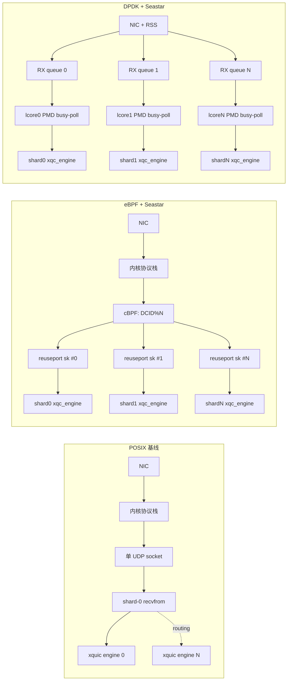

# 网络栈对比：POSIX / eBPF+Seastar / DPDK+Seastar

> 对应 xquic 仓库中三种数据通路的数据平面与控制平面对比，便于选型与运维参考。
> 所有路径/行号引用基于本仓库当前快照。

---

## 1. 总览

| 维度            | POSIX 基线         | eBPF + Seastar              | DPDK + Seastar             |
| --------------- | ------------------ | --------------------------- | -------------------------- |
| 入口位置        | 内核 socket        | 内核 socket + cBPF 分流     | DPDK PMD（绕过内核）       |
| 多核扩展        | 应用层路由         | 内核 SO_REUSEPORT + cBPF    | 网卡 RSS + per-core queue  |
| 拷贝            | 1 次               | 1 次（per-core 本地）       | 0 次（hugepage 直访）      |
| 轮询            | 被动 epoll         | epoll + 反应器              | busy-poll PMD              |
| 部署门槛        | 低                 | 中（≥4.19 内核, CAP_NET_ADMIN）| 高（绑定网卡、hugepage）   |
| 内核可观测性    | 完整               | 完整 + bpftool              | 不可见                     |
| 失败回退        | —                  | 自动退回 POSIX shard-0      | 启动直接失败               |

---

## 2. 数据平面（Data Plane）

### 2.1 POSIX 基线

- 单 UDP socket，`recvfrom()` 单包接收
  ([demo/demo_server.c](../demo/demo_server.c#L1054), [demo/demo_server.c](../demo/demo_server.c#L1114))
- libevent epoll 驱动，被动唤醒
- 多核扩展依赖应用层路由：shard-0 收包后再分发
  ([tests/xquic_server_seastar.cpp](../tests/xquic_server_seastar.cpp#L835))
- 适合开发/调试，无环境前置

### 2.2 eBPF + Seastar

- 每个 shard 创建独立 `SO_REUSEPORT` UDP socket
  ([tests/xquic_ebpf_reuseport.h](../tests/xquic_ebpf_reuseport.h#L78))
- 主线程注入 cBPF 程序，按 QUIC 长/短头解析 DCID[0]，`% shard_count` 选 socket
  ([tests/xquic_ebpf_reuseport.h](../tests/xquic_ebpf_reuseport.h#L46-L78))
- CID 生成端嵌入 shard_id，保证连接稳定亲和
  ([tests/xquic_server_seastar_ebpf.cpp](../tests/xquic_server_seastar_ebpf.cpp#L1828))
- 数据通路仍走内核协议栈，可继续使用 `tcpdump/ss/netstat`
- 内核侧调优参考 [docs/EBPF_OPTIMIZATION_GUIDE.md](EBPF_OPTIMIZATION_GUIDE.md#L21-L36)：`rmem_max`、`udp_rmem_min`

### 2.3 DPDK + Seastar

- 网卡绑定 DPDK PMD，hugepage 缓冲池，绕过内核
- 每个 lcore 绑定一个 RX queue，DPDK RSS 在网卡内分流
- Seastar 通过 `has_per_core_namespace()` 识别 native 栈，每个 shard 各自绑端口
  ([tests/xquic_server_seastar.cpp](../tests/xquic_server_seastar.cpp#L659))
- burst recv + 零拷贝（仅传指针）
- 完全 busy-poll，CPU 持续 100%（设计上预期）

---

## 3. 控制平面（Control Plane）

### 3.1 启用与构建

| 模式            | CMake 选项                                               | 编译入口                              |
| --------------- | -------------------------------------------------------- | ------------------------------------- |
| POSIX           | 默认                                                     | `cmake .. && make demo_server`        |
| eBPF + Seastar  | `-DXQC_ENABLE_SEASTAR=ON`                                | [build_seastar.sh](../build_seastar.sh) |
| DPDK + Seastar  | `-DXQC_ENABLE_SEASTAR=ON -DSeastar_DPDK=ON`              | [build_seastar.sh](../build_seastar.sh) `dpdk` |

DPDK 详细构建步骤记录在仓库 memory：`/memories/repo/seastar-dpdk-build.md`，包含 quictls 路径与 Finddpdk patch 说明。

### 3.2 启动参数

- POSIX: `./demo/demo_server -p 8443 ...`
- eBPF: `./build_seastar/xquic_tests/xquic_server_seastar_ebpf --port 8443 --smp N [--no-ebpf]`
- DPDK: `./build_seastar_dpdk/xquic_tests/xquic_server_seastar --port 8443 --smp N --dpdk-pmd [--dpdk-port-index 0] [--overprovisioned]`

### 3.3 上层对接（H3 / MOQ）

- POSIX：单一 `xqc_engine` 实例，所有连接共享
- eBPF/DPDK：每 shard 一个独立 `xqc_engine`，CID 路由保证连接亲和
  ([tests/xquic_server_seastar_ebpf.cpp](../tests/xquic_server_seastar_ebpf.cpp#L600))

### 3.4 失败处理

- eBPF attach 失败时自动降级到 POSIX shard-0 模式
  ([tests/xquic_server_seastar_ebpf.cpp](../tests/xquic_server_seastar_ebpf.cpp#L1817))
- DPDK 启动失败（hugepage 不足、端口未绑定）直接退出，无回退路径

---

## 4. 路径流程图

---

## 5. 实测/参考数据

仓库中已有的可引用数据（请按需以现场实测为准）：

### 5.1 eBPF 实测（已采）

来源：[bench_results/bench_20260421_111636.csv](../bench_results/bench_20260421_111636.csv)（stress 模式 200 req）

| 配置                | RPS | Elapsed (ms) | Failures | Failure Rate |
| ------------------- | --- | ------------ | -------- | ------------ |
| eBPF smp=1          | 105 | 30198        | 16       | 0.50%        |
| eBPF smp=2          | 105 | 30220        | 16       | 0.50%        |
| eBPF-Fallback smp=1 | 105 | 30362        | 16       | 0.50%        |
| eBPF-Fallback smp=2 | 104 | 30740        | 16       | 0.50%        |

来源：[bench_results/bench_20260421_104847.csv](../bench_results/bench_20260421_104847.csv)（standard 50 req）

- eBPF-Fallback + smp=1：13 RPS / 14457 ms（最优）

> 备注：本机 VM 环境流量受限，绝对值仅作回归参考。

### 5.2 架构估算

来源：[SEASTAR_ARCHITECTURE_ANALYSIS.md](../SEASTAR_ARCHITECTURE_ANALYSIS.md#L570-L615)

- eBPF smp=2 vs POSIX smp=2：吞吐 ~1.9×
- eBPF smp=4 vs POSIX smp=4：吞吐 ~2.6×（最高 ~3.7×）
- POSIX 多核瓶颈：shard 0 CPU 95%+
- P99 延迟下降约 30–40%

### 5.3 DPDK 实测

- 仓库尚未提交完整结果；评估脚本与字段定义见
  [scripts/seastar_dpdk_server_eval.sh](../scripts/seastar_dpdk_server_eval.sh#L1-L40)
  及 [docs/PHASE3_SEASTAR_DPDK_SERVER_EVAL.md](PHASE3_SEASTAR_DPDK_SERVER_EVAL.md#L118-L137)
- 计划字段：`throughput_rps, cpu_percent, p50, p95, p99`

### 5.4 缺口

- POSIX 绝对吞吐基线未单独记录
- 各模式 P50/P95/P99 在 csv 中暂未拆分（脚本支持，结果待补）
- DPDK 端到端结果尚未入库

---

## 6. 选型建议

| 场景                       | 推荐栈            | 关键理由                              |
| -------------------------- | ----------------- | ------------------------------------- |
| 本地开发 / CI / 协议调试   | POSIX             | 无环境依赖，工具链完整                |
| 生产低延迟、可控部署成本   | eBPF + Seastar    | 多核线性扩展，回退安全，可观测性保留  |
| 裸金属 / 专用 NIC / 极限吞吐 | DPDK + Seastar    | 零拷贝 + busy-poll，最低 per-packet 开销 |

---

## 7. 参考文件

- [docs/EBPF_OPTIMIZATION_GUIDE.md](EBPF_OPTIMIZATION_GUIDE.md)
- [docs/DPDK_USAGE_GUIDE.md](DPDK_USAGE_GUIDE.md)
- [docs/DPDK_ENV_CHECK.md](DPDK_ENV_CHECK.md)
- [docs/PHASE3_SEASTAR_DPDK_SERVER_EVAL.md](PHASE3_SEASTAR_DPDK_SERVER_EVAL.md)
- [SEASTAR_ARCHITECTURE_ANALYSIS.md](../SEASTAR_ARCHITECTURE_ANALYSIS.md)
- [seastar_xquic.md](../seastar_xquic.md)
- [scripts/bench_seastar_ebpf.sh](../scripts/bench_seastar_ebpf.sh)
- [scripts/seastar_dpdk_server_eval.sh](../scripts/seastar_dpdk_server_eval.sh)
