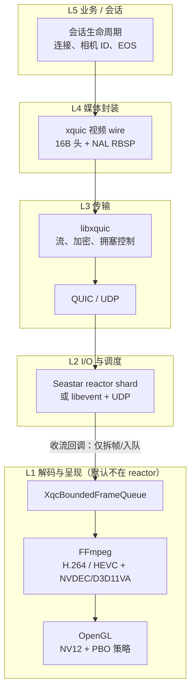

# 4K 低延迟：HEVC (H.265) + NVDEC + OpenGL PBO（Windows / Optimus / 8750H）

本文在 `docs/DPDK_SEASTAR_XQUIC_ARCHITECTURE_AND_ROADMAP.md` 的媒体边界之上（**视频 UDP 进入 Seastar / `xqc_engine_packet_process` 的位置见该文 §2.5**），把**主播放链路**写死为下面一条可实现的规格，并补充有界帧队列、AVFrame 生命周期、独显约束与绑核。

**实施顺序与验收阶段**（与当前 CMake/代码差距对照）：见 **[`VIDEO_LOW_LATENCY_WINDOWS_DEV_PLAN.md`](./VIDEO_LOW_LATENCY_WINDOWS_DEV_PLAN.md)**。

**主链路（接收 / 显示）**

`HEVC (H.265) 码流` → **FFmpeg + NVDEC（硬件解码）** → 统一 **`AV_PIX_FMT_NV12`**（必要时 `hwdownload` / `av_hwframe_transfer_data` 落到 CPU 可映射缓冲）→ **OpenGL `GL_PIXEL_UNPACK_BUFFER`（2 或 3 个 PBO，见 §5）** 异步上传 → **双纹理 NV12（R8 + RG8）+ fragment shader（BT.709 / BT.2020 SDR 可选）** → **V-Sync 全屏绘制**

**编码侧（发送，与上链对称但方向相反）**：**`hevc_nvenc`**（同机 4K 低延迟参数集）；**无 `av1_nvenc`**（Pascal / 1050 Ti）。

目标硬件仍以 **i7-8750H + GTX 1050 Ti Max-Q** 为基线。

---

## 0. 视频数据流与架构总览

本节给出 **端到端视频数据流** 与 **分层架构图**，与下文 §1（队列）、§5（PBO）、§6（FFmpeg/NVDEC）、§8（与 Seastar 边界）一致；实现样例见 `tests/lowlatency/`、`video_client`、`xquic_server_seastar`（可选 `XQC_ENABLE_LOWLATENCY_FFMPEG`）。

### 0.1 端到端数据流（发送 → 网络 → 收流 → 解码 → 呈现）

逻辑顺序：**采集/文件 → 封装（xquic 视频帧头）→ QUIC 字节流 → 对端重组 Annex-B →（可选）落盘与/或有界队列 → 解码线程 → NV12 →（可选）OpenGL PBO 显示**。

```mermaid
flowchart LR
  subgraph Send["发送侧"]
    A["摄像机 / 文件\n(H.264 / HEVC Annex-B)"]
    B["NAL 切分 + 帧头\nxqc_video_frame_header_t"]
    C["QUIC transport 流\nALPN: transport"]
    A --> B --> C
  end
  subgraph Net["网络"]
    N["UDP / QUIC\n(重传、乱序由 xQUIC 处理)"]
    C --> N
  end
  subgraph Recv["接收侧（示例：Seastar 或 libevent）"]
    R1["xqc_stream_recv\n累积 recv_body"]
    R2["按 16B 头解析\n完整 NAL payload"]
    R3["Annex-B 写盘\n*.h264（可选）"]
    R4["XqcBoundedFrameQueue\npush_drop_oldest"]
    N --> R1 --> R2 --> R3
    R2 --> R4
  end
  subgraph Decode["reactor / 回调外"]
    D1["解码专用线程\nFFmpeg avcodec"]
    D2["NV12 / GPU 表面\n(+ hwdownload 若需 PBO)"]
    R4 --> D1 --> D2
  end
  subgraph Present["显示（可选第二线程 / 主线程 GL）"]
    P1["GL_PIXEL_UNPACK_BUFFER\n2 或 3（§5.3）"]
    P2["R8 + RG8 纹理 + shader\nBT.709/2020"]
    P3["SwapBuffers / V-Sync"]
    D2 --> P1 --> P2 --> P3
  end
```



**要点（与 §8 对齐）**

- **reactor / `on_stream_read_notify`**：只做 **收字节、解析 wire、入队**；**禁止**在此路径内长时间 `avcodec_receive_frame` / `glMapBufferRange`。
- **两条抖动吸收带**：**解码前** 有界队列（§1）丢弃最旧、保最新；**解码后** PBO 环（§5）吸收「上传 vs V-Sync」错位。
- **当前仓库增量**：`xquic_server_seastar --video --video-decode` 将 Annex-B 切片送入 **单解码线程**；`video_client --decode-preview` 在发送侧 **镜像** 同一路径做本机验证（非对端回环）。

### 0.2 分层架构图（职责边界）



**与 `DPDK_SEASTAR_XQUIC_ARCHITECTURE_AND_ROADMAP.md` 的关系**：DPDK 仅作为 Seastar **可选网络后端**；**视频字节**仍经 **同一 `xqc_engine_packet_process` → 流回调** 进入上图 **L4**；**解码/GL** 不依赖 DPDK 是否存在。

### 0.3 关键对象与线程（实现对照）

| 环节 | 典型线程 / 上下文 | 仓库落点（示例） |
|------|-------------------|------------------|
| 发送封装 | `video_client` libevent 回调 | `tests/xqc_video_client.cpp`、`xqc_video_frame.h` |
| 收流解析 | Seastar shard reactor **或** `test_server` 同构回调 | `tests/xquic_server_seastar.cpp` 中 `process_video_frames` |
| 有界队列 + 解码 | **独立 `std::thread`** | `tests/lowlatency/xqc_h264_ff_decode_worker.cpp`、`xqc_bounded_frame_queue.hh` |
| PBO 策略 | **渲染线程 / WGL** | `tests/lowlatency/xqc_pbo_dynamic_manager.hh`、`xqc_nv12_gl_pbo_viewer.cpp` |

---

## 1. 有界帧队列（SPSC vs mutex + condition_variable）

### 1.1 选型

| 方案 | 适用 | 注意 |
|------|------|------|
| **SPSC 环形缓冲** | 单一解码线程生产、单一渲染线程消费；槽位数为 2–4 | 槽元数据建议为「指针 + 世代号」或 `std::atomic<uint64_t>` 封装的序号，避免 ABA；缓冲区为固定槽数组 |
| **mutex + condition_variable** | 将来多生产者、或需与 FFmpeg 回调线程灵活组合 | **锁内只做** 索引交换 / 指针赋值；**禁止** 在持锁时 `avcodec_send/receive` 或 `glMapBuffer` |

**推荐默认**：解码线程 ⇄ 渲染线程 **严格 SPSC** → 优先 **无锁环形队列**（或 `boost::lockfree::spsc_queue` 若项目已引入；否则自实现 2^n 槽 + 原子 head/tail）。

### 1.2 队列深度与背压

- **深度 2–3**：典型低延迟；深度 4 仅在抖动大时作为折中。
- **满队列策略（推荐）**：**丢弃队列中最旧的一帧，再推入当前帧**（等价于「始终保留最新解码完成帧」）。避免「满则阻塞解码线程」导致与网络环形缓冲叠加延迟。
- **空队列**：渲染线程重复上一帧或黑场由产品决定；低延迟产品常 **不重复显示旧帧** 而保持 V-Sync 节奏，避免「假流畅」。

### 1.3 与 Seastar 的边界

- **入队端**仅允许在**解码专用线程**（或从 reactor `submit_to` 投递到解码线程后的回调里）调用；**reactor 线程**只做把「网络侧已重组的字节」交给解码队列，**不**持有 `AVFrame*` 跨线程裸传 unless 用无拷贝环形槽中的原子提交语义。

---

## 2. AVFrame 生命周期（ref / unref / 池化）

### 2.1 最小正确模型（先落地）

1. 解码线程 `avcodec_receive_frame` 得到 `AVFrame *decoded`。
2. **入队前**：`AVFrame *slot = av_frame_alloc(); av_frame_ref(slot, decoded); av_frame_unref(decoded);`（或对 `decoded` 直接 move 所有权入队，则不再 ref 副本，二选一，全工程统一）。
3. **渲染线程取出后**：上传 GPU 完成后 **`av_frame_unref(slot)`**；若上传失败同样 unref，避免泄漏。

**原则**：任意时刻 **每个槽位最多一个 owner**；跨线程传递用 **ref 计数清晰的单一移交点**（环形队列写索引提交）。

### 2.2 池化（优化档）

- **目的**：降低 `av_frame_alloc` / 分配 `AVBufferRef` 频率；与 **硬件帧池**（`AV_CODEC_CAP_HARDWARE_FRAMES`）协同时注意 API 约束。
- **做法**：预分配 `N` 个 `AVFrame*`，解码前从池中取空帧作为 receive 目标（若解码器支持固定 surface 池）；或池化的是「队列槽结构体」：`{ AVFrame *frame; uint64_t seq; }`，帧仍来自 `av_frame_ref`。
- **硬件解码**：若帧绑定 `hw_frames_ctx`，**不可假设**帧缓冲长期有效；应在队列协议中规定：**消费方必须在下一帧覆盖该槽前完成 GL 上传**（深度 2 时尤其要严格顺序）。

### 2.3 与 HEVC + NVDEC + PBO 的衔接

- **NVDEC** 输出多为 **GPU 侧** 表面；**OpenGL PBO 路径**假设上传源在 **CPU 可写线性缓冲**（`NV12` 平面）。若当前帧仍在显存，须先 **`hwdownload` / `av_hwframe_transfer_data`** 得到 **`NV12`**，再 **`glMapBufferRange` / `memcpy` 写入 PBO** → `glTexSubImage2D(..., offset_in_PBO)`，由驱动 **DMA 到纹理**。
- **零拷贝升级**（非本基线必选项）：**D3D11 共享纹理 / CUDA–GL interop** 绑定显存纹理，可替代「下载 + PBO」；在此之前 **HEVC + NVDEC + PBO** 仍是 Pascal 上最易验证的闭环。
- **生命周期**：GPU 侧 surface 由 FFmpeg / 驱动管理；**`av_frame_unref` 须在 PBO 上传完成（及 `unmap`）之后**（或严格按「渲染线程消费完毕」语义移交），且下一帧覆盖槽位前不得复用指针。

---

## 3. Windows Optimus：强制 GTX 1050 Ti，全链路不落核显

### 3.1 应用与系统

1. **链接导出**（MSVC）：`extern "C" __declspec(dllexport) unsigned long NvOptimusEnablement = 0x00000001;`（或 `.def` 导出同名符号）。**仅声明请求**，不能替代运行时检查。
2. **系统**：设置 → 系统 → 显示 → 图形 → 为 **本进程 exe** 指定「高性能 = NVIDIA」。
3. **进程内验证（致命路径）**：创建 WGL 上下文后立即：
   - `const char *v = (const char *)glGetString(GL_VENDOR);`
   - `const char *r = (const char *)glGetString(GL_RENDERER);`
   - 若不含 **NVIDIA** / 预期 **1050 Ti** 字样，则 **记录错误并退出或禁用 GPU 路径**（避免 silent 跑到 Intel）。

### 3.2 FFmpeg（NVDEC）与 OpenGL（PBO）同卡

- **HEVC 硬解**：`hwaccel` 使用 **`hevc_cuvid` / D3D11VA 等指向本机 GTX 的实现**（以 FFmpeg 构建为准）；**`hw_device_ctx` 与 WGL 上下文必须落在同一 NVIDIA 适配器**。
- **D3D11VA**：创建 device 时选择 **与 GL 同一适配器的 DXGI Adapter**（枚举 `IDXGIFactory::EnumAdapters`，匹配 VendorId/DeviceId 或用户配置）。
- **CUDA**：`av_hwdevice_ctx_create` 指定 **同一 GPU 的 device index**；与 D3D 互操作若混用，需查 FFmpeg 文档是否支持当前组合。
- **禁止**：在核显上创建 GL context，却在独显上对 **H.265 走 NVDEC**（隐式拷贝与极高延迟）。

---

## 4. Seastar reactor 绑核（8750H）与留核 / 散热

### 4.1 拓扑（8750H）

- **6 物理核 × 2 SMT = 12 逻辑 CPU**。物理核 `P0..P5` 各对应两个逻辑 ID（Windows 与 Linux 编号不同，**以 `GetLogicalProcessorInformation` / coreinfo 为准**）。
- **原则**：每个 reactor 线程绑到 **不同物理核**；**避免**同一物理核上绑两个重载线程（两个 HT 同时跑 reactor + 重解码）。

### 4.2 示例分配（需按机器实测调整）

| 角色 | 建议 |
|------|------|
| **Seastar smp=4** | 占 **4 个物理核**，每核 1 个 reactor，且该核上尽量不安排第二个重任务 |
| **解码线程** | **独占 1 物理核**（可与 reactor 不同 NUMA 节点时注意，8750H 单 NUMA 简单） |
| **系统 / 中断 / DWM** | **至少留 1 物理核** 不绑满或仅轻载，降低调度与中断长尾 |

使用 Seastar 的 **`--cpuset`** 或 `taskset`/`StartThreadAffinity` 等价物传入 **逻辑 ID 列表**（文档化列表来源工具与版本）。

### 4.3 热与降频

- 采样：**CPU 有效频率、GPU 温度/频率、帧间隔 p95/p99**。
- **热保护**：码率阶梯下降、帧率 cap、短时降分辨率；与 **HEVC NVENC 编码 + HEVC NVDEC 解码 + OpenGL + reactor 同机** 时优先在规格中写清功耗预期。

---

## 5. OpenGL 显示：PBO（2 / 3）+ NV12 纹理 + BT.709/BT.2020 + V-Sync

本节描述 **NVDEC 解码得到 NV12 之后** 的 **OpenGL PBO 显示子系统**（与第 6 节 FFmpeg 输出约定一一对应）。**PBO 个数**按网络环境与产品目标在 **2** 与 **3** 之间选择，或采用 **§5.3 策略模式** 动态切换。

### 5.1 场景选择：局域网 vs 跨公网（xQUIC）

| 环境 | 推荐 PBO 深度 | 说明 |
|------|---------------|------|
| **局域网、链路稳定** | **2 PBO（双缓冲）** | 延迟最低、实现简单；在 RTT 小、丢包极低时性价比最高。 |
| **跨公网、经 xQUIC** | **优先评估 3 PBO（三缓冲）** | 微小丢包与重传会导致某帧 **略晚到达**；多一枚 PBO 提供 **显存级 Jitter Buffer**，上传与渲染之间允许更大 **时间错位**，通常能减轻 **顿挫 / micro-stutter**（代价见 §5.2）。 |

**注意**：应用层 **有界帧队列「最新帧优先」**（§1）与 **PBO 环形** 解决的是不同层面的抖动；公网场景下二者可叠加：**解码侧**吸收网络突发，**PBO 侧**吸收「上传未完成 vs 已到期 V-Sync」的错位。

### 5.2 原理：为何 2 PBO「够用」、3 PBO「更稳」

**双 PBO（double buffering）**

- **逻辑**：一帧 **CPU 写入 PBO / `glTexSubImage2D` 发起 DMA**（可记为 *upload*），另一帧对应的纹理 **正在被 shader 采样绘制**（*draw*）。
- **优点**：**端到端延迟最低**；只要「NV12 拷贝/映射 + DMA + 绘制」稳定地小于帧周期（例如 45fps 时约 **22.2 ms**），即可跑满帧率。
- **缺点**：若因 **公网抖动、QUIC 重传** 等导致 **某一帧晚到**，渲染侧可能在边界上 **没有已完成 DMA 的新纹理**，表现为 **等帧、重复旧帧或节奏突变**，主观上即 **顿挫感**。

**三 PBO（triple buffering）**

- **逻辑**：典型拆分：**写入**（map/fill 下一帧） / **已提交 DMA、等待用于绘制的一帧**（*ready*） / **当前 V-Sync 周期正在显示的一帧**（*display*）。三枚 `GL_PIXEL_UNPACK_BUFFER` 与对应纹理状态机轮换。
- **优点**：多一层 **显存侧缓冲**，更好地 **抹平** 网络带来的 **微小到达时间抖动**；帧间隔曲线往往 **更平滑**。
- **缺点**：在稳态下 **多容纳约一帧的流水线深度**，**理论端到端延迟**相对 2 PBO **大约增加一个帧周期**（例如 45fps 时约 **+22 ms** 量级，需用 §5.7 实测确认）；**额外一块 PBO + 纹理备份** 略增 **显存与驱动压力**。

**结论**：**2 PBO 是科学默认**；在 **追求极致画面节奏平滑** 且可接受略高延迟的 **生产公网** 场景，**支持 3 PBO** 并做 A/B 对比是合理工程选项。

### 5.3 动态 PBO 管理器（策略模式）

- **目的**：同一套渲染代码在 **「低延迟模式」**（2 PBO）与 **「抗抖动模式」**（3 PBO）间切换；便于在 **XPS 9570** 等目标机上 **对比指标**，也便于运行中 **根据网络质量** 自动升降级。
- **建议接口形态**：`IPboUploadStrategy` / `DoublePboStrategy` / `TriplePboStrategy`，由 **`DynamicPboManager`** 根据 **输入信号** 选择策略，例如：
  - xQUIC / 应用层统计：**RTT、p95、丢包或重传率、解码就绪间隔方差**；
  - 渲染侧自观测：**§5.7 帧间隔抖动** 超阈则 **2→3**，连续稳定则 **3→2**（带 **滞回**，避免频繁切换）。
- **切换注意**：策略变更最好在 **V-Sync 边界** 或 **黑场/切场景** 执行，清空或对齐 **in-flight DMA**，避免半帧撕裂与资源竞争。

### 5.4 流水线实现要点（承接 NVDEC → NV12）

- **输入**：来自第 6 节的 **`AV_PIX_FMT_NV12`**（`data[0]` / `data[1]`，`linesize[]` 可能大于 `width` / `width/2`）。
- **纹理**：`GL_TEXTURE0` → `GL_R8` 全分辨率 **Y**；`GL_TEXTURE1` → `GL_RG8` 半分辨率 **UV**（interleaved；与 FFmpeg NV12 平面顺序做一次色条 / 波形校准）。
- **2 PBO**：两枚 `GL_PIXEL_UNPACK_BUFFER` 奇偶轮换：`glBindBuffer` → `glMapBufferRange`（或 `glBufferSubData`）写入当前帧 NV12 → `glUnmapBuffer` → `glTexSubImage2D(..., offset_in_PBO)` 发起 **异步 DMA**；**绘制**仅使用 **已完成上传的上一轮** 纹理。
- **3 PBO**：第三枚用于 **「已填满、DMA 已提交、尚未轮到显示」** 的排队，使 **新帧晚到** 时仍常有一帧 **ready**，降低 **draw 侧空窗**。
- **V-Sync**：`wglSwapIntervalEXT(1)`（或等价）；若使用 **GLFW**，交换与计时可在 `glfwSwapBuffers` 前后打戳（见 §5.7）。

### 5.5 Shader

- **uniform**：`int color_matrix` 或 `mat3`：`BT.709 limited`、`BT.709 full`、`BT.2020 limited`（SDR 矩阵分支；**HDR PQ/HLG 单独立项**，不在此混写）。
- **片元**：与先前给出的 NV12→RGB 类似，矩阵系数按 ITU 常数表维护，避免魔法数散落。

### 5.6 对齐（与 NVDEC 输出 linesize 一致）

- `glPixelStorei(GL_UNPACK_ALIGNMENT, 1)` 为基线。
- **`GL_UNPACK_ROW_LENGTH`**：当 **`AVFrame.linesize[0] > width`**（Y）或 **UV 行步长与紧凑 `width/2` 不一致** 时必须分别对 **Y / UV 两次上传** 设置正确行长度，上传后再恢复默认，避免污染后续 OpenGL 状态。

### 5.7 XPS 9570 上对比 2 PBO 与 3 PBO：建议观测指标

在 **同一码率、同一 xQUIC 参数、同一绑核与散热条件** 下做对照，至少记录：

1. **帧间隔抖动（inter-frame jitter）**  
   每帧记录 **交换呈现** 相关耗时：若使用 GLFW，可在 **`glfwSwapBuffers` 前后** 打 **单调时钟**（如 `QueryPerformanceCounter`），得到 **帧间隔序列**；计算 **标准差 / p95-p50 / p99**，并画时间序列曲线。**预期**：**3 PBO** 在公网微抖动下 **曲线更平滑**（方差与尾部分布缩小），**2 PBO** 在局域网下 **均值延迟更低**。

2. **端到端延迟（E2E latency）**  
   使用 **摄像机同时拍摄** 带 **毫秒级源时钟** 的画面与 **本机显示器**，数 **源时钟读数与屏上画面** 的时差；对 **2 PBO vs 3 PBO** 各采多组，报告 **中位数与 p95**。**预期**：**3 PBO** 相对 2 PBO **可能增加约 1 帧量级延迟**（与 §5.2 一致），需与「顿挫感减轻」权衡写进产品规格。

3. **CPU 占用（尤其 Seastar 所在核）**  
   Seastar 为 **全核轮询**，**多一枚 PBO** 主要增加 **映射/分配与驱动 bookkeeping**；对比 **2 vs 3** 时盯住 **绑定了 reactor 的逻辑 CPU** 与 **解码线程所在核** 的 **利用率与频率是否更易触顶**。若 **3 PBO** 导致 **单核压力或降频抖动** 上升，应 **收紧策略切换条件** 或回到 **2 PBO**。

---

## 6. FFmpeg：HEVC (H.265) + NVDEC — 统一 NV12、行步长

本节约定 **码流为 HEVC (H.265)**，解码器走 **NVIDIA 硬件解码（NVDEC，FFmpeg 中常见为 `hevc_cuvid` 或等价的 D3D11VA/CUDA hwaccel，以构建为准）**，输出与 **第 5 节 OpenGL PBO** 对齐。

1. **解码器**：`AV_CODEC_ID_HEVC`；**`hw_device_ctx` / `hwaccel`** 绑定 **与 OpenGL 同一 GTX**。
2. **`get_format`**：优先 **`AV_PIX_FMT_CUDA` / `AV_PIX_FMT_D3D11` 等 NVDEC 相关硬件像素格式`**；为走 **PBO 显示路径**，在 GPU 帧上执行 **`hwdownload` 滤镜或 `av_hwframe_transfer_data`**，得到 **`AV_PIX_FMT_NV12`** 再交给渲染线程。
3. **固定展示路径为 NV12**（与 **H.265 + NVDEC** 主规格一致）；**I420** 仅作兼容分支，不作为 4K 主路径。
4. **linesize**：Y 用 `linesize[0]`，交织 UV 用 `linesize[1]`；与第 **5.6** 节 **`glPixelStorei(GL_UNPACK_ROW_LENGTH, ...)`** 严格对齐，避免花屏与带宽误判。

---

## 7. HEVC (H.265) 编码：`hevc_nvenc` — 4K 低延迟参数集（Pascal，无 `av1_nvenc`）

与第 6 节 **同一编码标准 H.265**：发送侧 **`hevc_nvenc`**，接收侧 **NVDEC**；便于对称测试与延迟对拍。

### 7.1 集成前必做

```bash
ffmpeg -h encoder=hevc_nvenc
```

以本机 FFmpeg 构建输出的 **实际选项名** 为准（不同版本略有差异）。

### 7.2 推荐方向（名称需与 `-h` 对齐）

| 维度 | 方向 |
|------|------|
| **preset** | 偏快档（如 `p1`–`p3`），在画质与延迟间实测 |
| **tune** | 若存在 **`ll`** / **zerolatency** 类，启用 |
| **GOP** | 短 GOP（如 15–30 帧量级 @45fps 按延迟目标调） |
| **B 帧** | **0 或极少**（`-bf 0` 或编码器等价） |
| **lookahead** | **0 或最小** |
| **RC** | 低延迟常用 **CBR** 或文档中的低延迟 VBR；码率按散热阶梯配置 |
| **额外 hw frame** | 最小化，避免编码器侧排队 |

### 7.3 实测

- 打点：**采集时间戳 → 编码完成 → 网络发出**（发送侧）；接收侧对齐已有 QUIC 统计。
- **1050 Ti**：明确 **不支持 `av1_nvenc`**；规格写 AV1 编码须标注 **软编或换卡**。

---

## 8. 与现有仓库的衔接（xquic + Seastar）

1. **解码 / OpenGL（PBO，2 或 3 枚按 §5）不进 reactor**：网络线程仅推送 **HEVC 压缩比特流** 至 **解码输入队列**（另一有界队列）；解码线程经 **NVDEC** 产出 **`NV12` `AVFrame` 槽** 再入 **渲染队列**；主线程或专用渲染线程只做 **PBO 上传 + shader + swap**。
2. **文档与 CI**：在 Windows 构建产物上增加 **启动 GPU 自检**（`GL_VENDOR` / `GL_RENDERER`）可选 **失败即退出** 模式，便于实验室流水线捕获 **NVDEC 在独显、OpenGL 却落到核显** 的配置错误。

---

**版本**：1.3 — 新增 **§0 视频数据流与分层架构图（Mermaid）**、与仓库收流/解码线程对照表；1.2 起已含 2/3 PBO、策略模式与 XPS 9570 观测指标  
**实现样例（W1–W5）**：见 **[`tests/lowlatency/README.md`](../tests/lowlatency/README.md)**（CMake 开关 `XQC_ENABLE_LOWLATENCY_PHASES`）。  
**后续**：实现阶段建议为 `hevc_nvenc` 参数集保存 **版本化 JSON**（含 FFmpeg commit 或 `--version` 字符串），便于回归对比延迟曲线；**NVDEC** 与 **PBO 策略（2/3）** 版本号可记入同一份 manifest。
